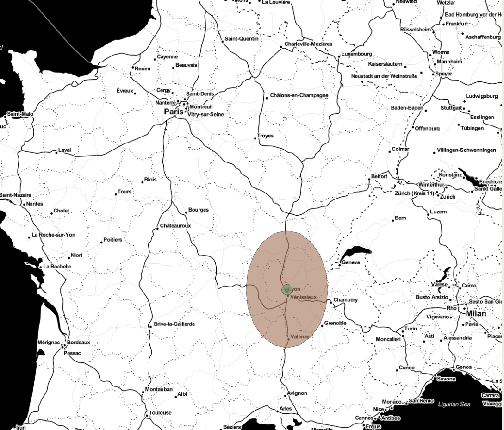

# Systèmes de projection spatiale

* [Avant-propos](#avant-propos)
* [Késako ?](#kesako)
* [Pourquoi c'est important ?](#pourquoi-cest-important-)
* [Comment on reprojette](#comment-on-reprojette)
* [Pour aller plus loin](#pour-aller-plus-loin) 

## Avant-propos

> ***Avertissement: les prochaines affirmations pourraient s'avérer dangereuses pour l'esprit d'un platiste. Si vous constatez un comportement anormal (*voir ci-dessous*), évoquez les documentaires complotistes sur les missions Apollo dans le but de calmer l'individu et de lui éviter un AVC soudain. ;-)*** 

<figure>
    
    <figcaption>
<i>Source: Giphy</i>
</figcaption>
</figure> 

La Terre est grossièrement une **sphère** aplatie aux pôles à cause de la rotation terrestre. Pour des raisons de représentation, il peut-être plus pratique d'utiliser des coordonnées planes dans un système de [projection cartographique](https://fr.wikipedia.org/wiki/Projection_cartographique) plutôt que des [coordonnées géographiques](https://fr.wikipedia.org/wiki/Coordonn%C3%A9es_g%C3%A9ographiques). 

## Késako ?
### En bref

Pour localiser des points, des lignes, des polygones dans l'espace terrestre (*nous parlons ici de l'espace en tant que surface/zone, il ne s'agit pas de s'attarder sur l'éventuelle présence de l'espace à **l'intérieur** de la Terre comme le suggère la "théorie" de la [Terre creuse](https://www.nationalgeographic.fr/sciences/la-terre-est-elle-creuse), restons un peu sérieux voulez-vous ! :-D*), il faut utiliser un [système géodésique](https://fr.wikipedia.org/wiki/Syst%C3%A8me_g%C3%A9od%C3%A9sique) et des coordonnées sous la forme de longitude et latitude (*souvent exprimées en degrés*) ou des coordonnées sur un plan (*coordonnées de projection*). 

Un système de projection implique donc une déformation, soit des surfaces, soit des formes. Petite démonstration avec [Cesium.js](https://cesiumjs.org/), avec [un site permettant de comparer la taille des continents](https://thetruesize.com/#) et avec ces [transitions animées avec D3.js](https://bl.ocks.org/mbostock/3711652). 

### Les types de projection

* ***projection équivalente***: conserve localement les surfaces
* ***projection conforme***: conserve localement les formes (*les angles*)
* ***projection aphylactique***: ni conforme, ni équivalente, mais peut conserver les distances sur les méridiens. 

### La traduction mathématique/géométrique

| Projection | Image | Source | Crédit |
|:-----------|:-----:|:------:|:------:|
| Cylindrique |  | [Wikipedia](https://fr.wikipedia.org/wiki/Projection_cartographique) | Infographie par Traroth sous GFDL. 22/03/2005 |
| Conique | | [Wikipedia](https://fr.wikipedia.org/wiki/Projection_cartographique) | Infographie par Traroth sous GFDL. 22/03/2005 |
| Azimutale |  | [Wikipedia](https://fr.wikipedia.org/wiki/Projection_cartographique) | Infographie par Traroth sous GFDL. 26/03/2005 |

> Il y a de nombreux systèmes de projection notamment car, avant l'arrivée du GPS, les mesures reposaient sur des principes et systèmes locaux. 
    
## Pourquoi c'est important ? 

Si on ne maîtrise pas la projection des données, il n'est pas possible de travailler dessus, car on ne sait pas à quoi correspondent les valeurs, il est donc *impossible* d'envisager de reprojeter les données ou d'effectuer des calculs sauf si on parvient à identifier la projection en observant les valeurs (*cela reste possible pour certaines projections couramment utilisée comme le WGS84 / EPSG 4326*). 

Connaître et bien choisir la projection permet également de savoir si on travaille avec des **degrés** ou avec des **mètres** par exemple. Si on souhaite mesurer des distances, par exemple, il faudra être prudent dans le choix de la projection utilisée ou de celle dans laquelle ou souhaite reprojeter les données. Il en va de même si on souhaite obtenir des buffers / zones tampons autour d'un polygone: donner 10 comme valeur au buffer n'aura pas du tout le même sens avec des mètres ou avec des angles. 

L'exemple suivant (*sous QGIS*) montre 2 buffers autour d'un même point mais avec des projections différentes. L'ellipse marron représente un buffer avec une valeur de ***1*** et l'ellipse verte un buffer avec une valeur de ***10 000*** mais dans le premier cas il s'agit de ***degrés*** et dans l'autre de ***mètres***.  

## Comment on reprojette

Pour reprojeter, tout dépend de vos préférences et compétences ainsi que de la masse de données à traiter:
* pour une transformation ponctuelle ou une vérification:
    * un exemple parmi d'autre: [epsg.io](https://epsg.io/transform#s_srs=4326&t_srs=3857)
* pour une transformation plus importante:
    * sans passer par du code:
        * utiliser [QGIS](https://www.qgis.org/en/site/) (*entre autres mais QGIS a l'avantage d'être open-source et gratuit*)
    * en codant (*Python*):
        * [Proj4](https://proj.org/)
        * [GeoPandas](http://geopandas.org/)
        * [Shapely](https://github.com/Toblerity/Shapely)
        * ...

## Pour aller plus loin

* [Page wikipédia sur les systèmes de coordonnées](https://fr.wikipedia.org/wiki/Syst%C3%A8me_de_coordonn%C3%A9es_(cartographie))
* [Wikipédia sur les coordonnées geographiqes](https://fr.wikipedia.org/wiki/Coordonn%C3%A9es_g%C3%A9ographiques)
* [Wikipedia Projection cartographique](https://fr.wikipedia.org/wiki/Projection_cartographique)
* [Librairie Python pour les reprojections](https://proj.org/)
* [Librairie Python pour la gestion d'objets spatiaux basée sur Pandas](http://geopandas.org/)
* [Librairie Python pour générer des objets spatiaux](https://github.com/Toblerity/Shapely)
* [Liste des projections cartographiques](https://fr.wikipedia.org/wiki/Liste_de_projections_cartographiques)
* [Tester, transformer quelques coordonnées](https://epsg.io/4326)
* [Pour obtenir des boundinx box](http://tools.geofabrik.de/calc/#type=geofabrik_standard&bbox=5.538062,47.236312,15.371071,54.954937&tab=1&proj=EPSG:4326&places=2)
* [QGIS, pour manipuler des objets spatiaux sans coder](https://www.qgis.org/en/site/)
* [Un peu de fun](https://hi.stamen.com/an-ode-to-d3-js-projections-9d6477d6da0b)
* 
